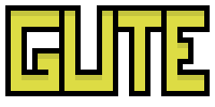

# gute

Gute is a simple web games library. It gives you a game loop, input, sounds, music and tilesets. I'll probably add some bitmap font support. You can find a sample for using it over at:

https://github.com/kevglass/gute-test

# Installation

```npm install gute```

# Example

https://kevglass.github.io/gute/test/

JS Source code: https://kevglass.github.io/gute/test/game.js

# Docs

https://kevglass.github.io/gute/


